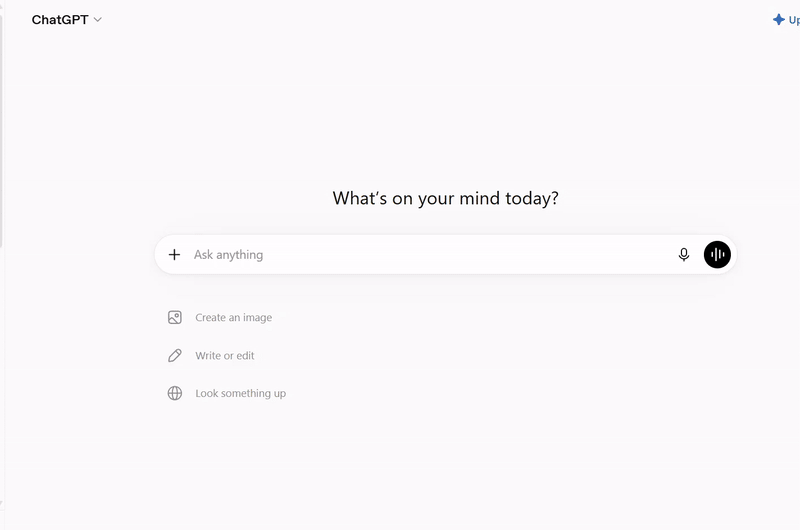
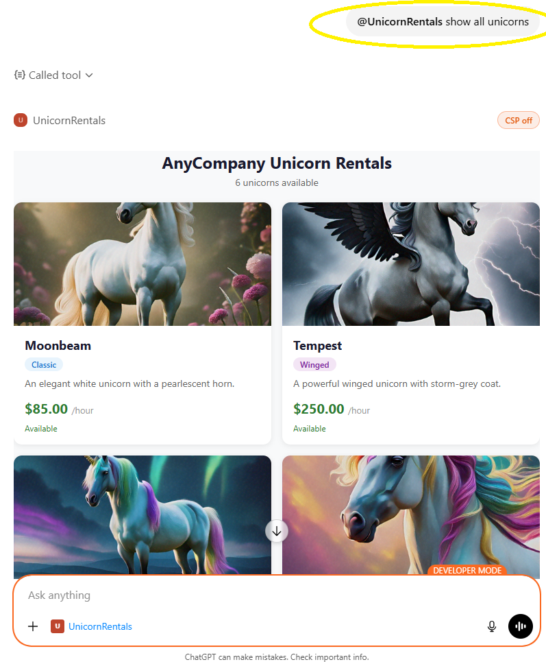
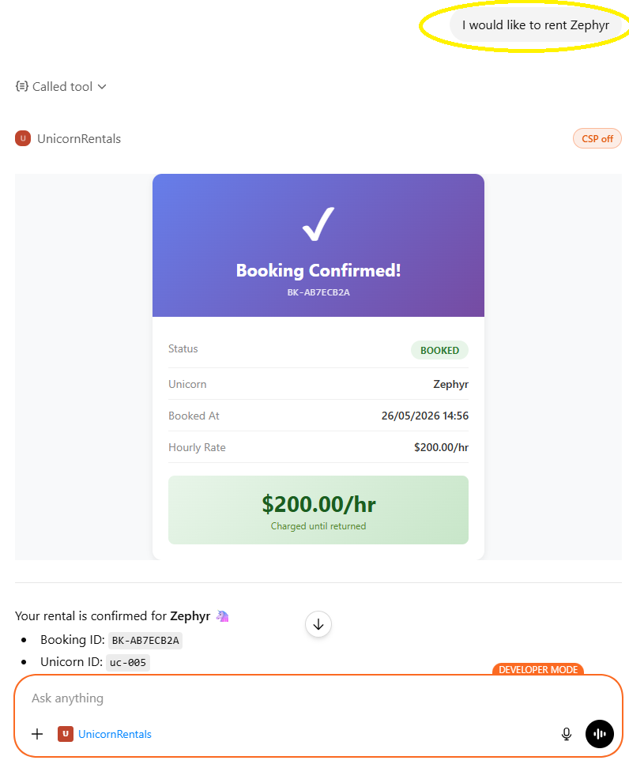
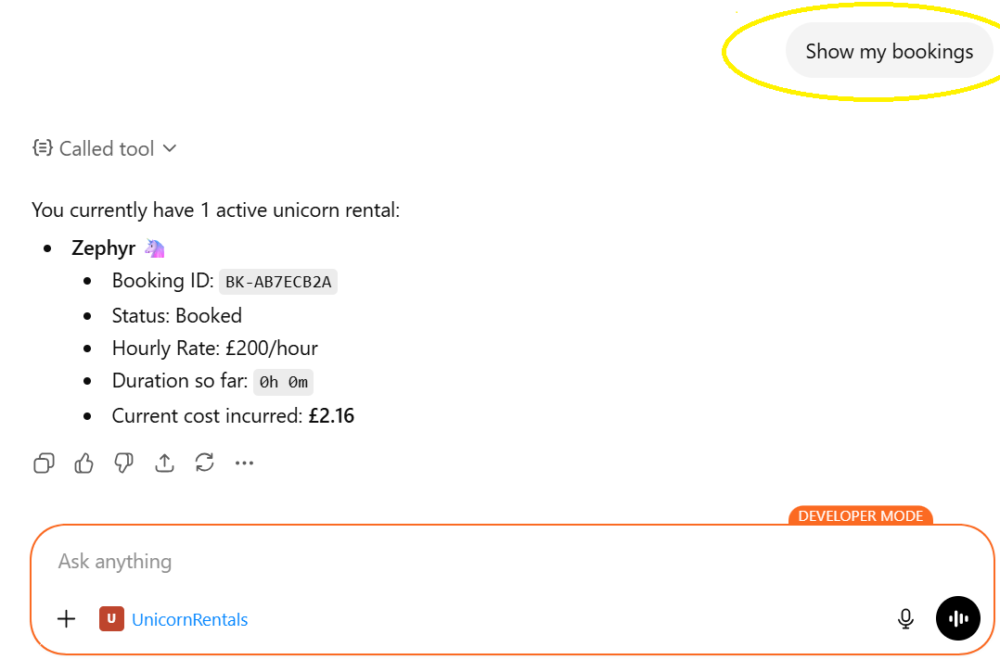
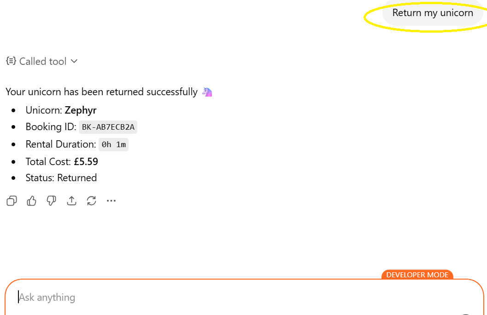
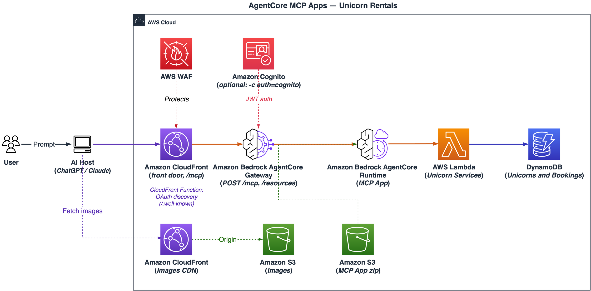

# AgentCore MCP Apps

Enterprises building AI-powered experiences need a way to expose their backend services as interactive, conversational tools — without rewriting APIs or coupling to a single AI host. This project demonstrates how to do that using **[MCP Apps](https://modelcontextprotocol.io/extensions/apps/overview)** — an extension to the Model Context Protocol that lets MCP servers deliver interactive HTML user interfaces rendered directly inside AI hosts like ChatGPT, Claude, and VS Code Copilot — deployed on **Amazon Bedrock AgentCore Runtime**.

The sample implements **Unicorn Rentals** — a conversational rental service with rich interactive widgets rendered inline. Because MCP Apps are host-agnostic, the same server works across any supporting client. Customers can:

- **List unicorns** — Browse the full fleet with details like name, speed, color, availability and hourly rate
- **Book a unicorn** — Reserve a unicorn at its hourly rate and receive a booking confirmation
- **View active rental** — Monitor the current booking status and elapsed time
- **Return a unicorn** — End the rental and receive an automatic duration-based invoice

> **Disclaimer:** This sample is provided for demonstration purposes and is not intended for production use without further security hardening, testing, and review appropriate to your environment.

---

This sample shows how to deploy an [MCP (Model Context Protocol)](https://modelcontextprotocol.io/) server with [MCP Apps](https://modelcontextprotocol.io/extensions/apps/overview) on [Amazon Bedrock AgentCore Runtime](https://docs.aws.amazon.com/bedrock/latest/userguide/agentcore.html), fronted by [Amazon Bedrock AgentCore Gateway](https://docs.aws.amazon.com/bedrock-agentcore/latest/devguide/gateway-core-concepts.html), and connect it to AI hosts (ChatGPT, Claude, etc.) with rich interactive widget UI.

## Tech Stack

- **MCP Server**: Node.js 22 / TypeScript
- **Business Logic**: Python Lambda (DynamoDB access)
- **Gateway**: Amazon Bedrock AgentCore Gateway (MCP protocol, No Auth inbound)
- **Edge**: Amazon CloudFront front door + AWS WAF (CLOUDFRONT scope) + CloudFront Function for OAuth discovery
- **Infrastructure**: AWS CDK (TypeScript)
- **Runtime**: Amazon Bedrock AgentCore Runtime (NODEJS_22)

## Demo

The full **list unicorns** flow — from a natural-language request to the rendered widget:



Individual actions:

| Action | Screenshot |
|-----------|---------|
| List Unicorns: | <a href="docs/images/list.png"></a> |
| Book Unicorns: | <a href="docs/images/book.png"></a> |
| Show bookings: | <a href="docs/images/show.png"></a> |
| Return unicorn: | <a href="docs/images/return.png"></a> |

You will be able to interact with the app with requests like:
1. List all unicorns
1. I would like to book Stardust unicorn
1. Show me my unicorn bookings
1. I would like to return my unicorn

## Architecture



**How it works:**
| Component | Purpose |
|-----------|---------|
| **CloudFront front door + WAF** | The public MCP entry point. CloudFront reverse-proxies to the Gateway; the associated WAF Web ACL (CLOUDFRONT scope) enforces the IP allowlist, managed rules and rate limiting at the edge. A CloudFront Function answers OAuth protected-resource discovery with the front-door domain (no Lambda@Edge needed) |
| **AgentCore Gateway** | MCP endpoint behind the front door — aggregates MCP targets and handles tool discovery |
| **AgentCore Runtime (MCP Server)** | Managed runtime hosting the MCP server (Node.js 22) — handles MCP protocol, tool definitions, structured output, widget resources, and delegates business operations to the service Lambda |
| **Unicorn Rental Service** (Python) | Lambda function that implements business logic (list, book, view, return unicorns) with DynamoDB access |
| **DynamoDB** | Stores unicorn inventory and booking records |
| **S3 + CloudFront** | Serves unicorn images referenced by widgets |

### How It Works

#### Registration (Connecting the MCP App to an AI Host)

1. **You provide the App details** to the AI host (ChatGPT, Claude, etc.), including the MCP Server URL — the CloudFront front-door endpoint (`GatewayResourceUrl` output).
2. **The AI host** sends MCP `tools/list` and `resources/list` requests to the front-door URL. CloudFront evaluates them against the WAF Web ACL and forwards allowed requests to the AgentCore Gateway.
3. **AgentCore Gateway** forwards the requests to the AgentCore Runtime via the configured MCP Server target (authenticated with IAM SigV4).
4. **AgentCore Runtime (MCP Server)** receives the requests. The MCP App hosted on it defines MCP tools (e.g., `list_unicorns`, `book_unicorn`) and MCP resources (e.g., widget HTML templates). It responds with the full list of tools and resources.
5. **The AI host** receives the tool and resource definitions and may cache them for future use, enabling tool invocation and widget rendering in subsequent interactions.

#### Request Flow (Tool Calls)

1. **The MCP host** (ChatGPT, Claude, etc.) sends an MCP JSON-RPC request (e.g., `tools/call` with `list_unicorns`) to the CloudFront front-door URL.
1. **CloudFront** receives the request. The associated WAF Web ACL evaluates it against IP allowlist rules, rate limiting, and managed rule sets — blocked requests are rejected at the edge, before ever reaching AWS Region infrastructure. Allowed requests are proxied (caching disabled) to the AgentCore Gateway.
1. **AgentCore Gateway** forwards the MCP request to the AgentCore Runtime via the configured MCP Server target, authenticating with IAM (SigV4).
1. **AgentCore Runtime (MCP Server)** receives the MCP request and invokes the Unicorn Service Lambda.
1. **Unicorn Service Lambda** executes the business logic against DynamoDB and returns the results.
1. **AgentCore Runtime (MCP Server)** wraps the response in MCP structured output with widget resource references and returns it through the Gateway to the host.

#### Resource Flow (Widget Rendering)
1. If the tool has an associated resource URI (for example, ui://widget/unicorn-list), the AI host initiates this phase. Tools without an associated widget such as view_bookings and return_unicorn, return text-only content and skip this phase entirely. 
1. The host sends an MCP resources/read request for that URI. 
1. The request reaches the MCP App through the AgentCore Gateway. 
1. The MCP App resolves the resource URI and returns the self-contained HTML of the widget. AI host might cache this data for better performance. 
1. The host renders the HTML in a sandboxed iframe, injecting the structured data from the tool response via the MCP Apps lifecycle. 
1. The widget fetches the images needed from Amazon CloudFront which uses Amazon S3 as the origin. 


## Deployment

### Prerequisites

- AWS account with [Amazon Bedrock AgentCore](https://docs.aws.amazon.com/bedrock/latest/userguide/agentcore.html) enabled. AgentCore is only available in [certain regions](https://docs.aws.amazon.com/bedrock-agentcore/latest/devguide/) — `us-west-2` is a safe default
- AWS CLI v2 configured (`aws configure`). Use a recent build: the `bedrock-agentcore` commands used for troubleshooting were added in later v2 releases
- Node.js 22+ (for MCP server and AWS CDK)
- AWS CDK CLI: `npm install -g aws-cdk` (or rely on the bundled `npx cdk`)

### Deploy in one command

```bash
./deploy.sh
```

That's it. The script runs preflight checks (tooling, credentials, region support), builds the artifacts, installs CDK dependencies, bootstraps CDK if needed, and deploys the stack.

Deployment typically takes **10–20 minutes, occasionally up to an hour**. Everything except the CloudFront distribution is usually done within the first 5 minutes; CloudFront then takes as long as it takes to propagate, and the CLI looks stalled at roughly 43/49 resources while it does. That wait is normal — as long as `cdk deploy` has not reported an error, leave it running.

When it finishes, note the **`GatewayResourceUrl`** output: that is the MCP Server URL you paste into your AI host.

Useful variations:

```bash
./deploy.sh --require-approval never       # skip the IAM approval prompt
./deploy.sh -c projectName=my-unicorns     # override the default 'unicorn-mcp' project name
./deploy.sh -c auth=cognito                # Cognito JWT inbound auth on the Gateway (see Security)
```

### Verify your deployment

The Gateway sits behind a CloudFront front door protected by AWS WAF with a **default-deny** policy that only allows the ChatGPT and Claude egress ranges (see [Security](#security)). A useful consequence is that the endpoint is not publicly reachable — but it also means **you cannot call your own endpoint** after deploying: every request returns `HTTP 403`.

To smoke-test it anyway:

```bash
./verify.sh
```

This temporarily adds your public IP to the WAF allowlist, runs `initialize` → `tools/list` → `tools/call list_unicorns` against the live endpoint, prints a pass/fail summary, then **removes your IP again** (including if a check fails or you interrupt it).

If you want to keep poking at the endpoint yourself — for example with [MCP Inspector](https://github.com/modelcontextprotocol/inspector) — use `./verify.sh --keep-ip` and remember to remove the entry afterwards.

> **Note on tool names:** through the Gateway, tools are exposed as `<target>___<tool>` (for example `unicorn-mcp-runtime-target___list_unicorns`), and the Gateway also injects its own `x_amz_bedrock_agentcore_search` tool. AI hosts handle this for you; it only matters if you are calling the MCP API directly.

<details>
<summary><strong>Manual steps (if you prefer to run each stage yourself)</strong></summary>

#### Step 1: Build All Artifacts

The build script packages the MCP Server for AgentCore Runtime:

```bash
./build.sh --clean
```

This script:
1. Installs MCP server dependencies (clean install via `--clean` flag for reproducible builds)
2. Bundles widget HTML files with Vite using `vite-plugin-singlefile` (inlines the MCP Apps SDK so widgets work on any host without external CDN dependencies)
3. Bundles the Node.js server with esbuild into a single `main.js`
4. Packages everything into `build/mcp-server-deployment.zip`

The `--clean` flag removes `node_modules` and `package-lock.json` before installing, ensuring a reproducible build. Omit it for faster local iteration when dependencies haven't changed.

The build output is pure JavaScript — no native modules — so it runs on ARM64 AgentCore Runtime regardless of the build host architecture.

#### Step 2: Install CDK Dependencies

```bash
cd infrastructure/cdk
npm install
```

#### Step 3: Bootstrap CDK (first time only)

If this is the first time deploying CDK in your AWS account/region, you need to bootstrap:

```bash
npx cdk bootstrap
```

#### Step 4: Synthesize the CloudFormation Template

Verify the stack synthesizes without errors:

```bash
npx cdk synth
```

You can optionally pass a custom project name via context:

```bash
npx cdk synth -c projectName=unicorn-rentals
```

The default project name is `unicorn-mcp`.

#### Step 5: Deploy

```bash
npx cdk deploy
```

</details>

### What gets deployed

CDK will:
1. Create the S3 deployment bucket and upload the MCP server zip
2. Create DynamoDB tables and seed them with unicorn data
3. Deploy the **Unicorn Service Lambda** with DynamoDB permissions
4. Create the IAM role for AgentCore with S3 read and Lambda invoke permissions
5. Create the AgentCore Runtime (MCP Server) pointing to the service Lambda
6. Deploy the **AgentCore Gateway** with No Auth inbound and MCP Server target (IAM outbound auth)
7. Deploy the **WAF Web ACL** (CLOUDFRONT scope, `EdgeWafStack` in us-east-1) and a **CloudFront front door** for the Gateway with the Web ACL attached, plus a **CloudFront Function** that serves `/.well-known/oauth-protected-resource` with the front-door domain
8. Apply a **resource-based policy** restricting runtime invocation to the Gateway only

Note the outputs printed after deployment — you'll need the `GatewayResourceUrl` to connect an MCP host.

### Connect to an MCP Host

After deployment, connect the Gateway endpoint to your preferred host:

- **ChatGPT** — [ChatGPT Setup Guide](docs/chatgpt-setup.md)
- **Claude** — [Claude Setup Guide](docs/claude-setup.md)

Both guides cover configuration steps, demo prompts, and troubleshooting. You'll need the `GatewayResourceUrl` from the CDK output.

## Security

This project implements multiple layers of security to protect the MCP endpoint and backend services:

### 1. WAF IP Allowlisting (CloudFront front door)

AWS WAF (CLOUDFRONT scope, deployed in us-east-1) is associated with the CloudFront distribution in front of the AgentCore Gateway, with a **default-deny** policy. Only requests originating from allowlisted IP ranges are permitted through. The deployed stack includes outbound IP ranges for both ChatGPT ([OpenAI outbound IPs](https://openai.com/chatgpt-actions.json)) and Claude ([Anthropic outbound IPs](https://docs.anthropic.com/en/api/ip-addresses)). To connect additional MCP hosts or for testing the MCP server directly using tools like MCP Inspector, add their outbound IP ranges to the WAF IP set.

### 2. WAF Managed Rules (Common Attack Protection)

- **AWS Managed Rules Common Rule Set** — Blocks requests matching common attack patterns
- **AWS Managed Rules Known Bad Inputs** — Blocks requests with payloads known to be associated with exploitation
- **Rate Limiting** — Blocks IPs exceeding 1,000 requests per 5-minute window

### 3. IAM Authentication (Gateway to Runtime)

The AgentCore Gateway authenticates to the AgentCore Runtime using IAM (SigV4 signing). The Gateway's execution role is granted `bedrock-agentcore:InvokeAgentRuntime` permission on the runtime ARN.

### 4. Custom domain readiness (CloudFront Function instead of Lambda@Edge)

The [AgentCore custom-domains guide](https://docs.aws.amazon.com/bedrock-agentcore/latest/devguide/gateway-custom-domains.html) recommends a Lambda@Edge `ORIGIN_RESPONSE` function to fix the `/.well-known/oauth-protected-resource` discovery document, which otherwise advertises the Gateway's own domain. This sample uses a **CloudFront Function** on the viewer request instead: it generates the discovery response directly at the edge from the request's `Host` header, so it is correct for the default `*.cloudfront.net` domain and for any custom domain you attach later — at a fraction of Lambda@Edge's cost and latency, with no us-east-1 Lambda replication. If you switch the Gateway to an OAuth (e.g. Amazon Cognito) inbound authorizer, add the issuer to `authorization_servers` in `infrastructure/cdk/lib/functions/oauth-discovery.js`.

> **Known limitation (default deployment):** the Gateway's own `*.gateway.bedrock-agentcore.*` URL (the `GatewayDirectUrl` output) remains reachable and bypasses CloudFront/WAF, since WAF is no longer associated with the Gateway itself and the Gateway uses No Auth inbound. Do not distribute that URL — or deploy with `-c auth=cognito` (below), which closes the bypass.

### 4b. Optional: Cognito JWT inbound auth (`-c auth=cognito`)

Deploying with `./deploy.sh -c auth=cognito` switches the Gateway's inbound authorizer from No Auth to **Amazon Cognito**:

- A machine-to-machine **Cognito User Pool** (no sign-ups, no human users), a resource server exposing the `mcp-gateway/invoke` scope, a hosted domain for the `/oauth2/token` endpoint, and an app client with the **client_credentials** flow.
- The Gateway validates every request's `Authorization: Bearer` JWT against the pool (`GatewayAuthorizer.usingCognito`), restricted to that app client. Requests without a valid token are rejected **by the Gateway itself**, so the direct-URL bypass above no longer applies — WAF at the edge and JWT auth at the Gateway become independent layers.
- The CloudFront Function automatically advertises the Cognito issuer in `authorization_servers` of the `/.well-known/oauth-protected-resource` document.

Fetch a token and call the endpoint (outputs `CognitoTokenEndpoint`, `CognitoClientId`, `CognitoUserPoolId`):

```bash
SECRET=$(aws cognito-idp describe-user-pool-client --user-pool-id <CognitoUserPoolId> \
  --client-id <CognitoClientId> --query 'UserPoolClient.ClientSecret' --output text)
TOKEN=$(curl -s -X POST <CognitoTokenEndpoint> -u "<CognitoClientId>:$SECRET" \
  -H 'Content-Type: application/x-www-form-urlencoded' \
  -d 'grant_type=client_credentials&scope=mcp-gateway/invoke' | jq -r .access_token)
curl -4 -X POST <GatewayResourceUrl> -H "Authorization: Bearer $TOKEN" ...
```

> Note: ChatGPT/Claude connectors negotiate OAuth via dynamic client registration, which Cognito does not offer — the Cognito mode is aimed at programmatic MCP clients (and at demonstrating the pattern); the default No Auth + IP-allowlist mode is what the ChatGPT/Claude setup guides assume.

### 5. Resource-Based Policy (AgentCore Runtime)

A resource-based access policy is attached directly to the AgentCore Runtime. It explicitly allows only the AgentCore Gateway's execution role to invoke the runtime, and denies all other principals. This ensures the runtime cannot be accessed directly, bypassing the Gateway and its WAF protections.

## Cleanup

The deployed stacks have standing costs even when idle — the WAF Web ACL, the CloudFront distributions and the AgentCore Runtime all bill while they exist. Tear everything down when you are finished:

```bash
cd infrastructure/cdk
npx cdk destroy --all
```

Deletion takes a few minutes, again mostly waiting on CloudFront. The DynamoDB tables and S3 buckets are configured to delete with the stack, so nothing is left behind.
