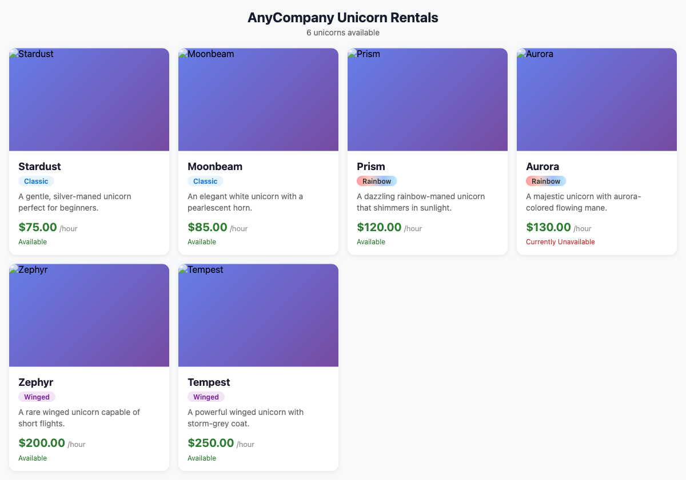
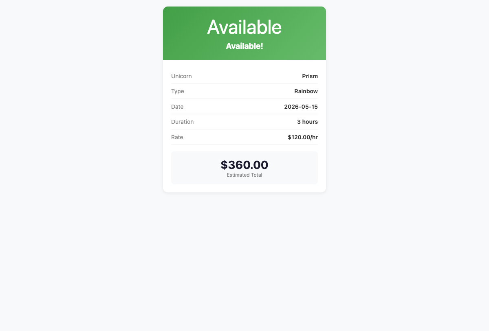
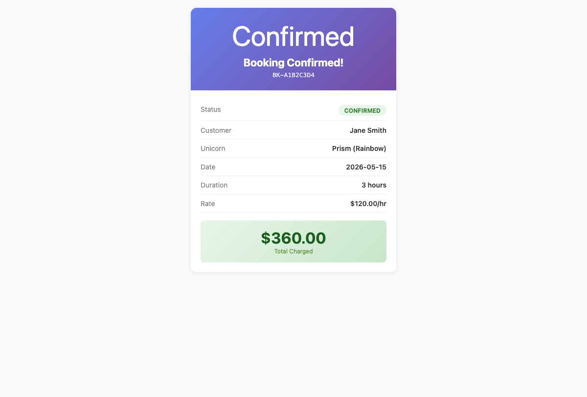

# Deploy MCP Server on Amazon Bedrock AgentCore for ChatGPT

This sample shows how to deploy an [MCP (Model Context Protocol)](https://modelcontextprotocol.io/) server on [Amazon Bedrock AgentCore Runtime](https://docs.aws.amazon.com/bedrock/latest/userguide/agentcore.html) and connect it to ChatGPT with rich widget UI support.

## Architecture


**How it works:**

- **User → ChatGPT** — The user sends natural language prompts (e.g. "Show me available unicorns") via ChatGPT, which translates them into MCP tool calls.
- **AWS WAF** — Protects the API Gateway with a ChatGPT IP allowlist, AWS Managed Rules (XSS, SQLi, Log4j), and rate limiting (1000 req/5 min).
- **API Gateway → Proxy Lambda** — Receives the MCP JSON-RPC POST request and the Lambda translates it into an `InvokeAgentRuntime` call to Bedrock AgentCore.
- **Bedrock AgentCore Runtime** — Hosts the MCP server (Python 3.13, direct code deploy from S3). Handles MCP protocol, tool definitions, structured output, and customer identity resolution. A resource-based policy restricts invocation to the Proxy Lambda only.
- **Unicorn Service Lambda** — Pure business logic layer invoked by the MCP server. Implements list, book, view, and return operations against DynamoDB.
- **DynamoDB** — Two tables store unicorn inventory (`unicorns`) and booking records (`bookings`). Atomic conditional updates prevent double-booking race conditions.
- **CloudFront → S3** — Serves widget HTML templates and unicorn images that ChatGPT renders inline as rich interactive UI cards.
- **S3 (Deployment)** — Stores the MCP server ZIP artifact used by AgentCore Runtime's direct code deploy mechanism.

## Prerequisites

- AWS account with [Amazon Bedrock AgentCore](https://docs.aws.amazon.com/bedrock/latest/userguide/agentcore.html) enabled
- AWS CLI configured
- Docker installed (for building container images)
- **Terraform >= 1.5** OR **AWS CDK >= 2.170** (choose one)
- Python 3.12+ (for Lambda proxy and Python MCP server)
- Node.js 22+ (for TypeScript MCP server and CDK)

## Quick Start

### 1. Deploy Infrastructure

**Option A: Terraform**

```bash
cd infrastructure/terraform
cp terraform.tfvars.example terraform.tfvars
# Edit terraform.tfvars with your preferred region and project name
terraform init
terraform apply
```

**Option B: CDK**

```bash
cd infrastructure/cdk
npm install
npx cdk bootstrap   # First time only
npx cdk deploy
```

### 2. Build and Push MCP Server Image

```bash
# Python server
./scripts/build-push-image.sh python

# OR TypeScript server
./scripts/build-push-image.sh typescript
```

### 3. Upload Widgets to S3

```bash
# Get the S3 bucket name from Terraform/CDK outputs
./scripts/upload-widgets.sh <s3-bucket-name>
```

### 4. Test the Deployment

```bash
# Get the Runtime ARN from Terraform/CDK outputs
python scripts/test-runtime.py us-east-1 <runtime-arn>
```

### 5. Connect to ChatGPT

1. In ChatGPT, go to **Settings > Apps & Connectors > Advanced settings** and enable **Developer mode**
2. Go to **Settings > Connectors > Create**
3. Enter your `mcp_endpoint_url` as the **Connector URL**
4. Open a new chat, click **+ > More**, select your connector, and try: *"Show me all available unicorns"*

See the full [ChatGPT Setup Guide](docs/chatgpt-setup.md) for detailed instructions, demo prompts, OAuth setup, and troubleshooting.

## Widget Previews

When tools execute, ChatGPT renders rich UI widgets inside the chat:

| Unicorn List | Availability Check | Booking Confirmation |
|:---:|:---:|:---:|
|  |  |  |
| `list_unicorns` tool | `check_availability` tool | `book_unicorn` tool |

## MCP Server Variants

| Variant | Path | Runtime | Widget Approach |
|---------|------|---------|-----------------|
| **Python** | `mcp-server/python/` | FastMCP + `structuredContent` in text | Hosted on S3/CloudFront via `openai/outputTemplate` |
| **TypeScript** | `mcp-server/typescript/` | `@modelcontextprotocol/sdk` + `ext-apps` | Bundled widgets + `RESOURCE_URI_META_KEY` |

## Project Structure

```
.
├── mcp-server/
│   ├── python/          # Python MCP server
│   └── typescript/      # TypeScript MCP server + widgets
├── lambda/              # Lambda proxy handler
├── scripts/             # Build, upload, and test scripts
├── sample-widgets/      # Widget HTML for S3 upload (Python server)
├── infrastructure/
│   ├── terraform/       # Terraform IaC
│   └── cdk/             # AWS CDK IaC
└── docs/                # Architecture and setup guides
```

## Security

See [CONTRIBUTING](CONTRIBUTING.md#security-issue-notifications) for more information.

## License

This library is licensed under the Apache 2.0 License. See the LICENSE file.
