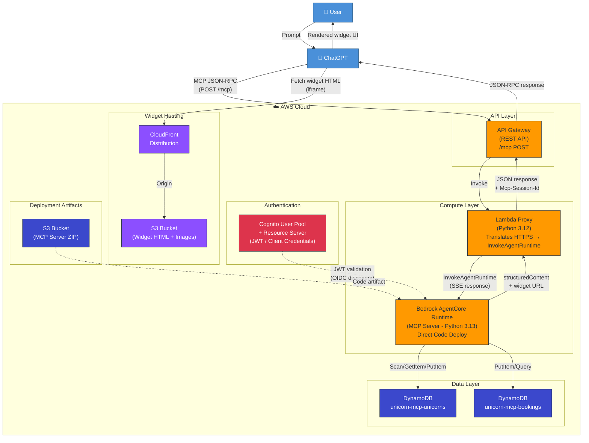
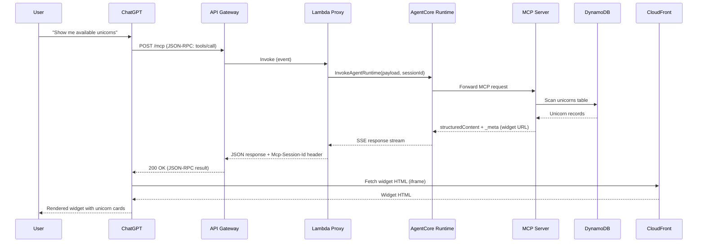

# Architecture Diagram

## Component Summary

| Component | Service | Purpose |
|-----------|---------|---------|
| API Gateway | Amazon API Gateway (REST) | Public HTTPS endpoint for ChatGPT MCP connector |
| Lambda Proxy | AWS Lambda (Python 3.12) | Translates HTTP POST into `InvokeAgentRuntime` calls, parses SSE |
| AgentCore Runtime | Amazon Bedrock AgentCore | Hosts the MCP server container (direct code deploy from S3 ZIP) |
| MCP Server | Python 3.13 (FastMCP) | Implements `list_unicorns`, `check_availability`, `book_unicorn` tools |
| DynamoDB (Unicorns) | Amazon DynamoDB | Stores unicorn inventory (6 seeded records) |
| DynamoDB (Bookings) | Amazon DynamoDB | Stores booking records |
| Cognito | Amazon Cognito | Issues JWTs for AgentCore Runtime authentication (client credentials flow) |
| CloudFront | Amazon CloudFront | CDN for widget HTML and unicorn images |
| S3 (Widgets) | Amazon S3 | Origin bucket for widget assets and images |
| S3 (Deployment) | Amazon S3 | Stores the MCP server deployment ZIP artifact |

## Request Flow (Sequence)

